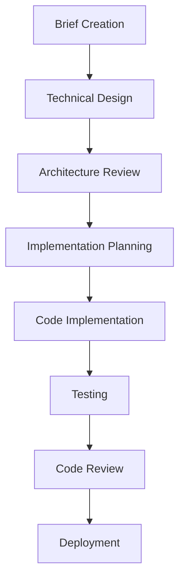

# Engineering Briefs Directory

This directory contains initial briefs for all engineering projects and features. Following the AI Engineering Operations Handbook process, **every feature or significant change must start with a brief** before moving to design and implementation phases.

## Purpose

Engineering briefs serve as the foundation for our multi-step AI engineering operations process by:

- **Defining clear requirements** and acceptance criteria
- **Identifying technical approach** and architecture considerations  
- **Setting quality standards** and testing requirements
- **Establishing timeline and ownership** for accountability
- **Creating review workflows** and approval checkpoints

## Brief Structure

Each brief should include:

### 1. **Project Information**
- Creation date and project type
- Status and phase tracking
- Owner and reviewer assignments
- Estimated timeline and milestones

### 2. **Requirements & Objectives**
- Clear problem statement
- User stories or use cases
- Acceptance criteria
- Success metrics and KPIs

### 3. **Technical Approach**
- Architecture considerations
- Technology choices and rationale
- Integration points with existing systems
- Performance and scalability requirements

### 4. **Implementation Plan**
- Breakdown of tasks and dependencies
- Development phases and milestones
- Testing strategy and coverage requirements
- Deployment plan

### 5. **Quality Considerations**
- Security requirements
- Testing approach (unit, integration, e2e)
- Documentation requirements
- Monitoring and observability needs
- Rollback plan

## Process Flow

## Naming Convention

Use descriptive filenames that include:
- **Project type**: `feature`, `bugfix`, `refactor`, `infrastructure`, etc.
- **Feature name**: Brief description of functionality
- **Date**: Creation month/year for tracking

**Examples**:
- `feature-user-authentication-jan2024.md`
- `bugfix-payment-processing-feb2024.md`
- `infrastructure-ci-cd-improvements-mar2024.md`

## Status Tracking

Include status in brief header:
- **Brief Complete**: Ready for technical design phase
- **Design In Progress**: Architecture and approach being planned
- **Ready for Implementation**: Approved design and plan
- **In Development**: Code implementation underway
- **In Review**: Code ready for peer review
- **Ready for Deployment**: Approved and tested
- **Deployed**: Live in production with monitoring

## Quality Checklist

Before moving from brief to design phase, ensure:

- [ ] Clear, measurable objectives defined
- [ ] Acceptance criteria specifically identified
- [ ] Technical approach documented
- [ ] Dependencies and risks identified
- [ ] Timeline and ownership assigned
- [ ] Review process defined

## Examples

See example briefs in this directory for comprehensive templates showing all required elements and best practices.

## Integration with AI Engineering Operations

This briefs directory integrates with our Cursor Rules (`.cursor/rules/*.mdc`) to ensure:

- **Consistent Process**: AI assistant always starts with brief creation
- **Quality Gates**: Design and review requirements are enforced
- **Architecture Alignment**: Context from architecture files is automatically considered
- **Approval Workflows**: Human oversight is built into every step

By maintaining this disciplined approach to engineering, we ensure every feature meets our quality standards and technical objectives while making the most effective use of AI assistance.

